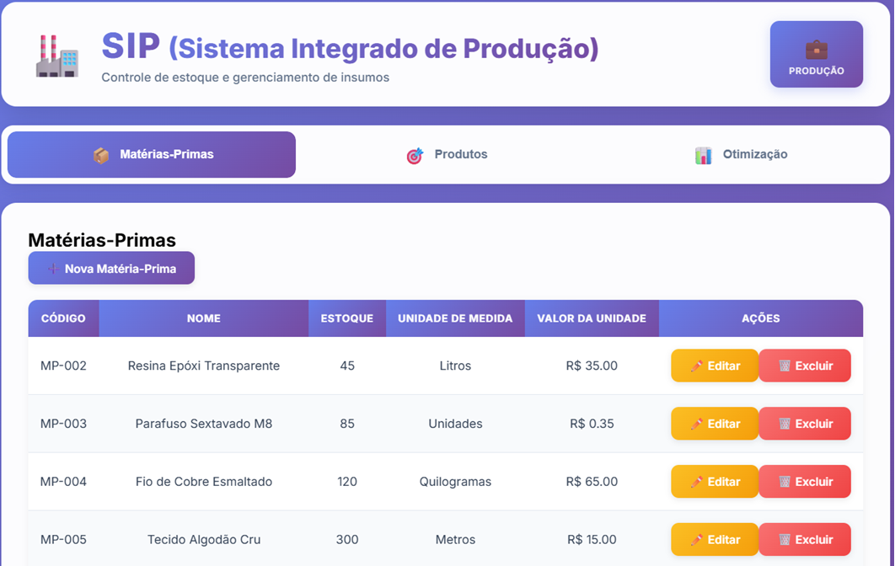
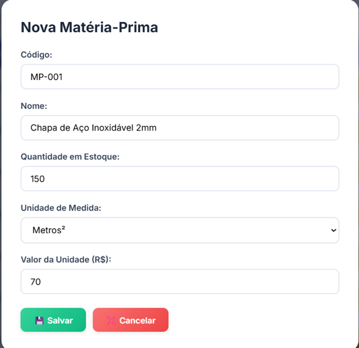
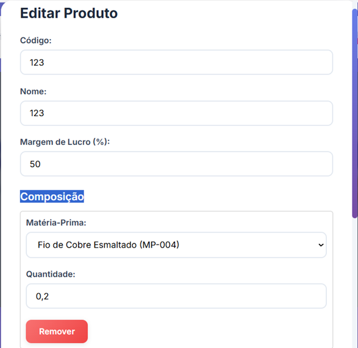
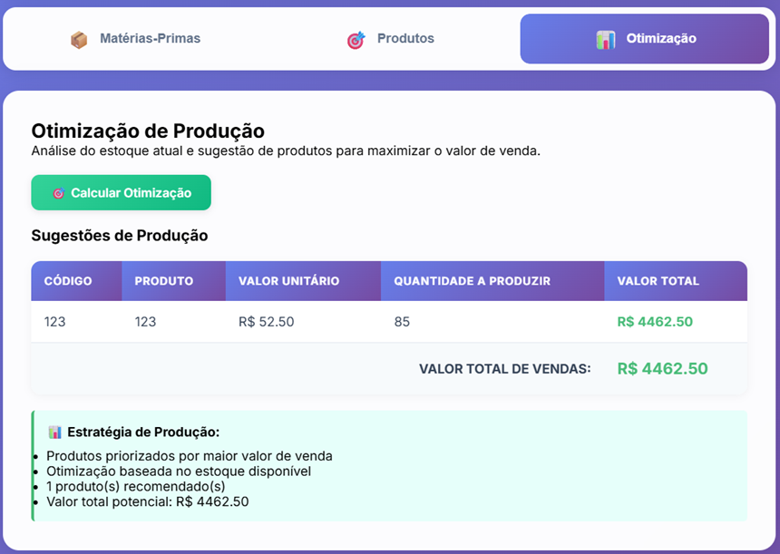

# 📊 Apresentação do SIP (Sistema Integrado de Produção)

<div align="center">

## 🏭 Controle de estoque e gerenciamento de insumos

Sistema completo para gestão de matérias-primas, cadastro de produtos e otimização de produção com foco em retorno financeiro.

</div>

---

## 🎯 Funcionalidades Principais

### 1. Gestão de Matérias-Primas

Controle completo do estoque de insumos com **ordenação alfabética automática por código**.

<p align="center">
  
</p>

**Recursos:**
- ✅ Código único com ordenação automática (ex: MP-003, MP-004, MP-005, MP-006)
- ✅ Controle de estoque em tempo real
- ✅ Múltiplas unidades de medida (Unidades, Quilogramas, Litros, Metros, etc)
- ✅ Valor unitário para cálculo de custos
- ✅ Interface responsiva com ações rápidas (Editar/Excluir)

---

#### 📝 Cadastro/Edição de Matéria-Prima

<p align="center">
  
</p>

**Dados cadastrados:**
- **Código**: Identificador único (ex: MP-002)
- **Nome**: Descrição do insumo (ex: Resina Epóxi Transparente)
- **Quantidade em Estoque**: Controle de disponibilidade (ex: 45)
- **Unidade de Medida**: Seleção entre 10 opções padrão (Litros, Quilogramas, etc)
- **Valor da Unidade**: Custo de aquisição em R$ (ex: 35.00)

---

### 2. Gestão de Produtos

Cadastro de produtos finais com composição detalhada e **cálculo automático de preços**.

<p align="center">
  
</p>

**Recursos:**
- ✅ Cálculo automático do **Custo Total** baseado na composição
- ✅ **Margem de Lucro** configurável (padrão 50%)
- ✅ **Valor de Venda** calculado automaticamente
- ✅ Visualização completa da composição de cada produto
- ✅ Rastreamento de matérias-primas utilizadas

**Fórmula de Precificação:**
```
Valor de Venda = Custo Total × (1 + Margem/100)
```

---

#### 📝 Cadastro/Edição de Produto

<p align="center">
  
</p>

**Dados cadastrados:**
- **Código**: Identificador do produto (ex: 123)
- **Nome**: Nome do produto final
- **Margem de Lucro**: Percentual sobre o custo (ex: 50%)
- **Composição**: Lista de matérias-primas e quantidades
  - Seleção inteligente com código e nome (ex: "Fio de Cobre Esmaltado (MP-004)")
  - Quantidade por unidade produzida (ex: 0,2 quilogramas)
  - Opção de adicionar/remover múltiplas matérias-primas

**Exemplo de Composição:**
- Fio de Cobre Esmaltado: 0,2 kg → R$ 13,00
- Painel de LED Integrado: 1 unidade → R$ 22,00
- **Custo Total**: R$ 35,00
- **Valor de Venda** (50% margem): R$ 52,50

---

### 3. Otimização de Produção

Algoritmo inteligente que sugere a melhor estratégia de produção baseada no **estoque disponível**.

<p align="center">
  
</p>

**Recursos:**
- ✅ Análise automática do estoque atual
- ✅ Sugestão de produtos para maximizar valor de venda
- ✅ Cálculo de quantidade ideal a produzir
- ✅ Estimativa de valor total de vendas

**Estratégia de Otimização:**
1. Produtos priorizados por maior valor de venda
2. Otimização baseada no estoque disponível
3. Quantidade calculada respeitando limitações de insumos
4. Valor total potencial estimado

**Exemplo de Resultado:**
- **Produto**: 123 (R$ 52,50/unidade)
- **Quantidade a Produzir**: 85 unidades
- **Valor Total**: R$ 4.462,50 💰

---

## 🎨 Principais Características

### Interface Moderna
- ✨ Design clean com gradientes e sombras suaves
- 🎨 Paleta de cores profissional (roxo/azul)
- 📱 Layout responsivo e intuitivo
- ⚡ Navegação por abas fluida

### UX Otimizada
- 🔍 Identificação visual clara de registros
- ⚡ Botões de ação em destaque (Editar: amarelo / Excluir: vermelho)
- 📊 Tabelas com cabeçalhos destacados
- ✅ Feedback visual para todas as ações

### Recursos Técnicos
- 🔄 **Ordenação alfabética automática** por código
- 💾 Persistência em banco H2
- 🧪 Cobertura de testes unitários
- 🚀 API REST completa
- 📈 Cálculos automáticos de precificação

---

## 🚀 Tecnologias Utilizadas

<table>
<tr>
<td width="50%">

### Backend
- ☕ Java 21
- 🍃 Spring Boot 3.2.2
- 🗄️ Spring Data JPA
- 💾 H2 Database
- 📦 Maven
- 🧪 JUnit 5 + Mockito

</td>
<td width="50%">

### Frontend
- 💚 Vue 3
- ⚡ Vite
- 🌐 Axios
- 🎨 CSS3 com gradientes

</td>
</tr>
</table>

---

## 📝 Status do Projeto

✅ Sistema completo e funcional  
✅ Testes unitários validados (7/7 passing)  
✅ Persistência de dados implementada  
✅ Interface moderna e responsiva  
✅ Ordenação alfabética automática  
✅ Documentação atualizada  

**Última atualização:** 01/03/2026

---

## 📌 Como Usar

### 1️⃣ Cadastrar Matérias-Primas
- Acesse a aba "Matérias-Primas"
- Clique em "Nova Matéria-Prima"
- Preencha código, nome, estoque, unidade e valor
- Itens serão automaticamente ordenados por código

### 2️⃣ Cadastrar Produtos
- Acesse a aba "Produtos"
- Clique em "Novo Produto"
- Defina código, nome e margem de lucro
- Adicione composição (matérias-primas + quantidades)
- O sistema calcula automaticamente custo e preço de venda

### 3️⃣ Otimizar Produção
- Acesse a aba "Otimização"
- Clique em "Calcular Otimização"
- Visualize sugestões de produção
- Analise valor total potencial de vendas

---

## 🔗 Links Úteis

- **GitHub**: [gerenciamento-producao-industrial](https://github.com/VitorBrandaoBarbosaDeMelo/gerenciamento-producao-industrial)
- **Backend**: `http://localhost:8080`
- **Frontend**: `http://localhost:5173`
- **Console H2**: `http://localhost:8080/h2-console`

---

<div align="center">

### 💡 Desenvolvido com ☕ e Java 21

**SIP - Sistema Integrado de Produção**  
*Transformando dados em decisões inteligentes*

</div>